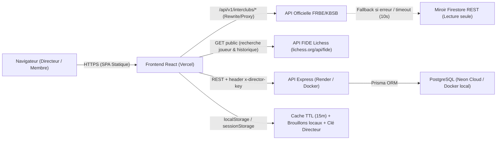

# Architecture Technique & Analyse Critique — Interclub Director Dashboard

Ce document présente les choix techniques globaux du projet **Interclub Director Dashboard**, explique comment s'articulent le frontend, le backend et les API externes (FRBE, Firestore, Lichess/FIDE), et propose une **analyse critique** assortie de pistes d'amélioration concrètes.

Les décisions structurantes détaillées sont formalisées dans le dossier [`docs/adr/`](./adr/README.md).

---

## 1. Vue d'ensemble de l'architecture

Le projet est organisé en **monorepo léger** (sans outil de workspace complexe comme Turborepo ou Nx) piloté depuis le `package.json` racine :

```text
interclub-dashboard/
├── interclub-dashboard/   # Frontend SPA (React 19 + TypeScript + Vite 8 + Tailwind v4)
├── server/                # Backend API REST (Express + Prisma + PostgreSQL)
├── docs/                  # Documentation technique et ADR
├── docker-compose.yml     # Stack locale Postgres 16 + API Express
└── DEPLOYMENT.md          # Procédure de déploiement gratuit (Vercel + Render + Neon)
```

### Schéma des flux de données


```mermaid
flowchart LR
    U["Navigateur (Directeur / Membre)"] -->|"HTTPS (SPA Statique)"| V["Frontend React (Vercel)"]

    V -->|"/api/v1/interclubs/* (Rewrite/Proxy)"| FRBE["API Officielle FRBE/KBSB"]
    FRBE -.->|"Fallback si erreur / timeout (10s)"| FS["Miroir Firestore REST (Lecture seule)"]

    V -->|"GET public (recherche joueur & historique)"| LIC["API FIDE Lichess (lichess.org/api/fide)"]

    V -->|"REST + header x-director-key"| API["API Express (Render / Docker)"]
    API -->|"Prisma ORM"| DB["PostgreSQL (Neon Cloud / Docker local)"]

    V -->|"localStorage / sessionStorage"| LS["Cache TTL (15m) + Brouillons locaux + Clé Directeur"]
```

---

## 2. Synthèse des choix techniques (Stack)

| Couche | Choix retenu | Fichiers clés | Alternative écartée |
| :--- | :--- | :--- | :--- |
| **Frontend UI** | React 19, TypeScript (`~6.0.2`), Vite 8, Tailwind CSS v4, `lucide-react` | `interclub-dashboard/package.json` | Next.js (SSR inutile ici), MUI/Chakra |
| **Gestion d'état** | `React Context` (`ClubContext`, `SimulatorContext`) + `useClubData` | `src/context/`, `src/hooks/useClubData.ts` | Redux Toolkit, Zustand, TanStack Query |
| **Proxy & Sources externes** | Rewrites Vercel (`vercel.json`) + Proxy Vite (`vite.config.ts`) + Fallback Firestore REST | `src/api/frbeClient.ts`, `src/api/firestoreFallback.ts` | BFF complet côté serveur, SDK Firebase |
| **Données FIDE** | Client REST direct vers `lichess.org/api/fide` avec matching flou (Levenshtein) | `src/api/fideClient.ts` | Scraping FIDE ou base locale |
| **Backend API** | Express 4 (`^4.21.0`), TypeScript 5, Prisma 5, PostgreSQL | `server/src/index.ts`, `server/prisma/schema.prisma` | Firebase/Supabase BaaS, NestJS |
| **Authentification** | Clé secrète partagée (`DIRECTOR_KEY` / header `x-director-key`) | `server/src/middleware/auth.ts` | OAuth/JWT multi-utilisateurs |
| **Règles métier** | Calculs TPR, classements, scouting, validation FRBE 100 % côté client | `src/domain/`, `src/domain/rules/frbeValidator.ts` | Moteur de règles côté serveur |
| **Feuilles de match PDF** | HTML/CSS `@media print` isolé via `ReactDOM.createPortal` | `src/components/simulator/MatchSheetModal.tsx` | `jsPDF`, `pdfmake`, `@react-pdf/renderer` |
| **Qualité / Linting** | `oxlint` + compilation `tsc -b` | `interclub-dashboard/.oxlintrc.json` | ESLint + Vitest/Playwright |

---

## 3. Ce qui fonctionne bien (Points forts)

1. **Coût d'exploitation nul et déploiement pragmatique** :
   Frontend statique sur Vercel, API Dockerisée sur Render Free Tier, PostgreSQL serverless sur Neon, sans SDK Firebase lourd (~300 KB économisés grâce aux appels REST bruts vers Firestore).
2. **Résilience face aux pannes de la FRBE** :
   Le basculement automatique de `frbeClient.ts` vers `firestoreFallback.ts` et la persistance locale (`localStorage` dans `SimulatorContext`) évitent qu'une panne du site fédéral le dimanche matin ne bloque le directeur.
3. **Séparation nette du domaine dans le frontend** :
   Le dossier `interclub-dashboard/src/domain/` isole bien les calculs purs (TPR, classements, scouting, export mail, validation FRBE) des composants React.
4. **Expérience d'impression légère et fidèle** :
   L'utilisation de CSS `@page { size: A4 landscape }` via portail React produit des feuilles de match propres sans alourdir le bundle JS avec une librairie PDF.

---

## 4. Critique architecturale & Axes d'amélioration prioritaires

Une revue critique du code actuel met en évidence **9 fragilités concrètes**, classées par niveau d'impact :

### 🔴 Critique — Risques structurels ou de sécurité

1. **[RÉSOLU] Modèle de données multi-clubs isolé** (`server/prisma/schema.prisma`)
   - **Historique** : À l'origine, `Round` n'avait aucun champ `clubId`. Deux clubs différents écrasaient leurs compositions respectives.
   - **Correction apportée** : `clubId Int @default(541)` a été ajouté au modèle `Round` avec la contrainte unique `@@unique([seasonId, clubId, roundNumber])`. Le backend et le frontend transmettent désormais le `clubId` à chaque lecture/écriture, garantissant un cloisonnement strict par club.

2. **[RÉSOLU] Sécurité de la clé Directeur (`DIRECTOR_KEY`), CORS strict et traçabilité d'audit** (`server/src/middleware/auth.ts`, `server/src/index.ts`, `server/src/routes/api.ts`, `server/prisma/schema.prisma`)
   - **Historique** : Clé par défaut codée en dur (`'director1234'`) dans le backend et frontend, transmission en query string (`req.query.directorKey`), absence de limitation de débit sur `/api/auth/verify`, configuration CORS permissive (`callback(null, true)`), et absence totale de traçabilité (`savedBy` inexistant).
   - **Corrections apportées** :
     - Élimination du fallback par défaut en production (rejet strict au démarrage si `DIRECTOR_KEY` n'est pas configuré).
     - Comparaison cryptographique en temps constant (`crypto.timingSafeEqual`) pour prévenir les attaques temporelles.
     - Rejet strict HTTP 400 de tout secret passé dans l'URL (query string) ; utilisation obligatoire des en-têtes HTTP `x-director-key` ou `Authorization: Bearer`.
     - Protection anti-brute-force par `express-rate-limit` (10 tentatives / 15 min par IP).
     - Filtrage CORS strict et normalisé rejetant formellement toute origine non autorisée.
     - Audit et traçabilité : champ `savedBy` dans PostgreSQL/Prisma (`Round`, `TeamDraft`) avec mémorisation de l'auteur dans `DirectorAuthModal.tsx` et affichage dans la barre d'état du simulateur.

3. **[RÉSOLU] Suite de tests automatisés et pipeline CI GitHub Actions** (`vitest`, `node:test`, `.github/workflows/ci.yml`)
   - **Historique** : Ni le frontend ni le backend ne contenaient de suite de tests, laissant les règles critiques FRBE et la sécurité vulnérables aux régressions silencieuses.
   - **Corrections apportées** :
     - **Frontend** : Installation de **Vitest** (standard moderne natif Vite/TypeScript) pour tester le domaine pur :
       - `src/domain/rules/__tests__/frbeValidator.test.ts` (13 tests) : descente de titulaire interdite, seuils de réserve, division 1 (seuil 1800 et top 4 à 2000), tolérance de permutation d'échiquiers et règles de moyennes croisées inter-équipes.
       - `src/domain/__tests__/performance.test.ts` (12 tests) : inversion des résultats en fonction de la perspective domicile/visiteur, forfaits et scores partiels.
     - **Backend** : Tests unitaires via le test runner natif de Node.js (`node:test` via `tsx`) :
       - `server/src/middleware/__tests__/auth.test.ts` (14 tests) : comparaison en temps constant `safeCompareKeys`, rejet strict des secrets dans les query strings, extraction d'auteur et garde-fou au démarrage en production.
     - **Pipeline CI** : Création du workflow `.github/workflows/ci.yml` exécutant à chaque push et Pull Request sur `main` les suites de tests et la compilation TypeScript/Vite/Prisma en environnement isolé.

### 🟠 Majeur — Maintenabilité & Cohérence technique

4. **[RÉSOLU] Unification du calendrier et autorité de saison** (`server/src/utils/season.ts`, `server/src/utils/calendar.ts`, `GET /api/season/current`, `firestoreFallback.ts`)
   - **Historique** : La saison `'2026-2027'` et les 11 dates de rondes étaient dupliquées et codées en dur à 4 endroits (`season.ts`, `calendar.ts`, contrôleurs serveur, `firestoreFallback.ts:5`), avec des formats hétérogènes (`'2026'` vs `'2026-2027'`).
   - **Corrections apportées** :
     - **Backend comme autorité** : `server/src/utils/season.ts` centralise la configuration des saisons (`DEFAULT_SEASON = '2026-2027'`), les calendriers officiels (`OFFICIAL_SEASON_CALENDARS`) et expose `GET /api/season/current`.
     - `calendar.ts` consomme désormais directement `getRoundDatesForSeason` au lieu de dupliquer un tableau de dates distinct.
     - **Normalisation universelle** : ajout de `normalizeSeasonYear` et `getSeasonStartYear` front & back permettant d'interchanger `'2026'`, `'2026-2027'`, `'2026–2027'` sans bug de casting.
     - **Nettoyage Firestore** : `firestoreFallback.ts` utilise dynamiquement `ACTIVE_SEASON` au lieu d'une URL codée en dur sur `/years/2026`.
     - **Tests unitaires** : 11 nouveaux tests dédiés (`server/src/utils/__tests__/season.test.ts` et `interclub-dashboard/src/domain/__tests__/season.test.ts`).

5. **[RÉSOLU] Validation de schéma Zod et règles FRBE côté serveur** (`server/src/validation/schemas.ts`, `server/src/validation/frbeRules.ts`, `draftsController.ts`)
   - **Historique** : L'API Express acceptait n'importe quel payload JSON sans validation structurelle, permettant l'injection de doublons d'échiquiers, de matricules invalides ou du même joueur dans deux équipes différentes à la même ronde.
   - **Corrections apportées** :
     - **Validation stricte de schéma (Zod)** : validation de `POST /api/rounds/:roundNumber/drafts` et `POST /api/rounds/:roundNumber/lock`. Rejet strict avec code HTTP 400 si un échiquier est dupliqué au sein d'une équipe, si un joueur est aligné dans plusieurs équipes pour la même ronde, ou si les numéros d'échiquiers dépassent la limite (1..8).
     - **Validateur de règles FRBE côté serveur** : implémentation de `validateRoundDrafts` vérifiant la complétude par division, l'interdiction de descente de titulaire, les plafonds Elo des réserves, les contraintes de Division 1 et les moyennes croisées.
     - **Comportement adapté (Brouillon vs Verrouillage)** : les brouillons en cours d'élaboration restent sauvegardables avec retour d'un rapport de validation informatif ; lors du verrouillage officiel (`POST /lock`), le serveur effectue une vérification exhaustive et signale les éventuelles infractions dans le message de statut.
     - **Tests unitaires dédiés** : 15 nouveaux tests unitaires (`schemas.test.ts` et `frbeRules.test.ts`).

6. **[RÉSOLU] Suppression du code mort et consolidation des modèles** (`src/modelsFRBE.ts`, suppression de `src/frbeGatewayCalls.ts` et `src/models/`)
   - **Historique** : Présence de 21 fichiers obsolètes issus d'anciens prototypes, dont `src/frbeGatewayCalls.ts` (84 lignes orphelines court-circuitant le proxy) et 20 fichiers de modèles dans `src/models/` dont seul `ResultEnum` était encore importé.
   - **Corrections apportées** :
     - Rapatriement de `ResultEnum` au sein de `src/modelsFRBE.ts`.
     - Mise à jour des imports dans `src/utility.ts` et `src/api/firestoreFallback.ts`.
     - Suppression définitive de `src/frbeGatewayCalls.ts` et de l'intégralité du dossier `src/models/` (21 fichiers supprimés).
     - Nettoyage du graphe de dépendances et réduction de la dette technique.

### 🟡 Mineur — Performance & Ergonomie technique

7. **Gestion du cache et rafale réseau au chargement** (`useClubData.ts`, `cache.ts`, `fideClient.ts`)
   - **Constat** :
     - Au chargement, `useClubData` lance en parallèle toutes les rondes `1..maxRound` (`Promise.all`) sans annulation (`AbortController`) si le `clubId` change.
     - `isFallbackMode` est une variable globale mutable exportée (`export let isFallbackMode = false` dans `frbeClient.ts`), ce qui est un anti-pattern réactif.
     - `clearCache()` nettoie `frbe_cache_*` mais oublie `fide_v3_*`.
     - Le cache `sessionStorage` est perdu à la fermeture de l'onglet et les rondes passées (immuables après validation) re-expirent toutes les 15 minutes.
   - **Amélioration** : Adopter `@tanstack/react-query` (déduplication, annulation, stale-while-revalidate) et passer le TTL des rondes clôturées à plusieurs heures/jours.

8. **Cold start Render Free Tier**
   - **Constat** : Sur le plan gratuit Render, le serveur s'endort après 15 min d'inactivité (latence de 30 à 50 s au réveil), alors que `backendClient.ts` applique des timeouts courts (`4000 ms` sur `/api/health`, `5000 ms` sur `fetchRoundDrafts`).
   - **Risque** : Le premier chargement après inactivité échoue silencieusement sur timeout et fait croire au frontend que le serveur est hors ligne.
   - **Amélioration** : Augmenter le timeout initial ou distinguer un état *"Réveil du serveur en cours..."* avec retry automatique, ou passer sur un hébergeur sans cold start agressif (ex: Koyeb/Railway/Fly ou cron healthcheck).

9. **Dépendance au moteur d'impression navigateur pour les PDF** (`MatchSheetModal.tsx`)
   - **Constat** : Le rendu dépend des paramètres d'impression Chrome/Firefox/Edge (en-têtes/pieds de page navigateur, case "Graphiques d'arrière-plan") et ne génère pas un fichier `.pdf` binaire téléchargeable en un clic pour l'envoi par mail.
   - **Amélioration** : Garder l'approche actuelle pour sa rapidité d'itération tant que l'impression papier prime ; envisager `pdf-lib` ou `@react-pdf/renderer` (chargé en *lazy import*) uniquement si un workflow automatisé d'envoi/archivage PDF devient requis.

---

## 5. Index des Architecture Decision Records (ADR)

- [ADR-001 : Stack Frontend SPA (React 19, Vite 8, Tailwind v4, Contexts)](./adr/001-frontend-react-vite-tailwind.md)
- [ADR-002 : Proxy FRBE, Cache `sessionStorage` et Miroir Firestore REST](./adr/002-frbe-proxy-cache-and-firestore-fallback.md)
- [ADR-003 : Backend Express + Prisma + PostgreSQL (Neon / Render)](./adr/003-backend-express-prisma-postgresql.md)
- [ADR-004 : Authentification par Clé Partagée (`DIRECTOR_KEY`) et Confidentialité](./adr/004-director-key-authentication-and-privacy.md)
- [ADR-005 : Logique Métier et Validation FRBE côté Client](./adr/005-client-side-domain-logic-and-duplication.md)
- [ADR-006 : Génération des Feuilles de Match via `@media print` et `createPortal`](./adr/006-native-print-portal-match-sheets.md)
- [ADR-007 : Stratégie de Tests Automatisés et Pipeline CI (Vitest, Node test, GitHub Actions)](./adr/007-automated-testing-strategy-and-ci.md)
- [ADR-008 : Unification de la Saison et Autorité du Calendrier](./adr/008-centralized-season-and-calendar-authority.md)
- [ADR-009 : Validation de Schéma Zod et Règles Métier FRBE Côté Serveur](./adr/009-server-side-validation-zod-and-frbe-rules.md)
